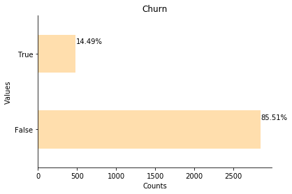
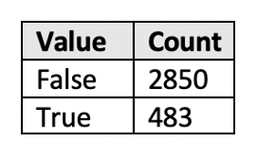
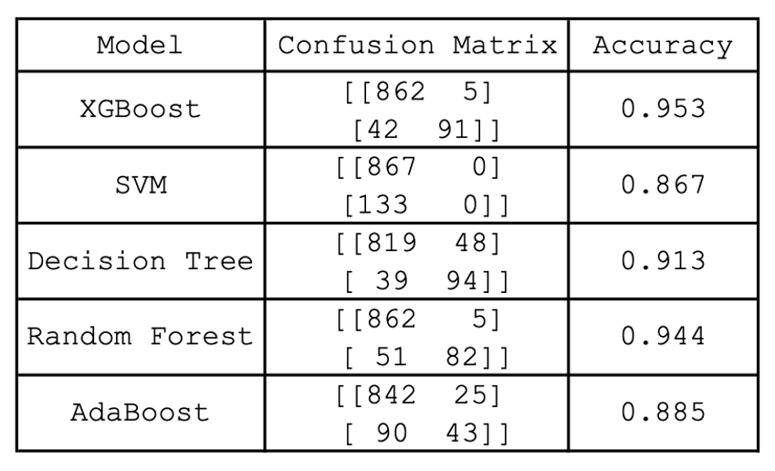
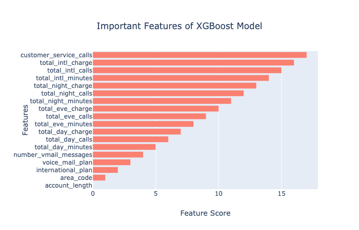
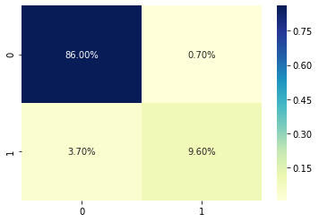
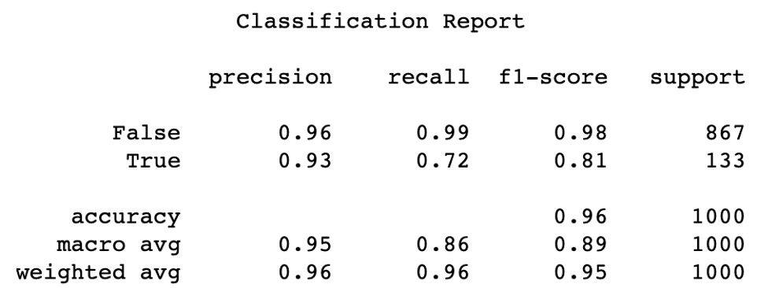

# SyriaTel Customer Churn Data
Module 3 Project<br>

Building a classifier to predict whether a customer will ("soon") stop doing business with SyriaTel.


# Outline
* EDA
* Model
* Conclusion
* Extensions

# EDA

## The Data
3333 entries of the following categories are evaluated:

* account length        
* area code             
* phone number          
* international plan    
* voice mail plan       
* number voice mail messages 
* total day minutes     
* total day calls       
* total day charge      
* total eve minutes     
* total eve calls       
* total eve charge      
* total night minutes   
* total night calls     
* total night charge    
* total international minutes   
* total international calls      
* total international charge     
* customer service calls
* churn 

## Churn
Predictions should be made on when customers are likely to leave (churn).


<br><br><br><br><br><br>

## Handling Categorical Data
* Area code is already numerical and only two values are represented so there is nothing to do.
* I believe state is not needed at this time. It will be dropped.
* To encode international_plan and voice_mail_plan I changed yes to 1 and no to 0.


# Model
After creating a baseline and selecting several models to try, a Random Forest model was determined to have the best results.

## Baseline
Random Forest on out-of-the-box data.<br><br>
RandomForestClassifier(bootstrap=True, class_weight=None, criterion='gini',
                       max_depth=None, max_features='auto', max_leaf_nodes=None,
                       min_impurity_decrease=0.0, min_impurity_split=None,
                       min_samples_leaf=1, min_samples_split=2,
                       min_weight_fraction_leaf=0.0, n_estimators=10,
                       n_jobs=None, oob_score=False, random_state=None,
                       verbose=0, warm_start=False
                       
Gave a train/test split of (0.986, 0.917).
This result is generally good for a baseline model and shows potential.

## Other Models
Following are other models used and their scores:

* The XGBoost score looks promising. 
* The Random Forest score changed from (0.986, 0.917) to (0.953, 0.941) showing improvement.
* However, SVM (1.0, 0.862) and Decision Tree appear (1.0, 0.907) to be overfitting.
* The AdaBoost score, though not as high, appears to be more consistent with the train/test scores (0.896, 0.885)


<br><br><br><br><br><br><br><br><br><br><br>
The XGBoost and Random Forest models are very similar. Random Forest has a higher predictive score and the confusion matrix holds slightly more true positives and true negatives. Additionally, it minimizes the false negatives.<br><br>
Note: other factors of the RF model were looked at, such at entropy, but did not improve the model.

# Features and Scores

## Important Features
As the Random Forest model provides the best model results, let's look at important features of this model.

<br>
Odd Note: The features increase in importance in a linear fashion. Made up data, coincidence, or does the formula calculate it this way.
<br>
<center><b>The most important features seem to be total_day_charge, total_day_minutes, and customer_service_calls.</b></center>

# Scores
Let's look closer at the confusion matrix and the classification report.<br><br>
<center><h4>Confusion Matrix</h4></center>

<br><br>
Interpretation of the confusion matrix.
* True Positives - 86%. This means that 86% of the time our model correctly predicts people who stay with Syriatel.
* False Positives - 3.7%. This means that 3.7% of the time our model incorrectly predicted the number of people who would stay with Syriatel
* False Negatives - 0.7%. This means that very few people were predicted to churn but actually stayed.
* True Negatives - 9.6%. This means that number of people who actually left Syraitel was predicted correctly 9.6% of the time.<br><br> 

<br><br>
Interpretation of the classification report.
* Precision – What percent of predictions were correct?
    * 96% of the time those who stayed were predicted correctly.
    * 93% of the time those who left Syriatel were predicted correctly.
* Recall - (Sensitivity) What percent of the positive cases did you catch? 
    * 99% our model found when a customer stayed
    * 72% our model found when a customer left

* Total Accuracy is 96%


# Conclusion


* The model can aid in identifying customers who my leave the company
* Key Features may by a clue to customer churn:
    * Calls to customer service
        * If Possible, offer incentives 
        * Ensure customers are satisfied 
    * International Calls
        * Check for better rates to aid customer
        * Possibly offer incentives

# Extensions
Other features to consider providing:
* customer features: basic information about the customer (e.g., age, income, house value, college education)
* support features: characterizations of the customer’s interactions with customer support (e.g., number of interactions, topics of questions asked, satisfaction ratings)
* usage features: characterizations of the customer’s usage of the service
* contextual features: any other contextual information we have about the customer


```python

```
